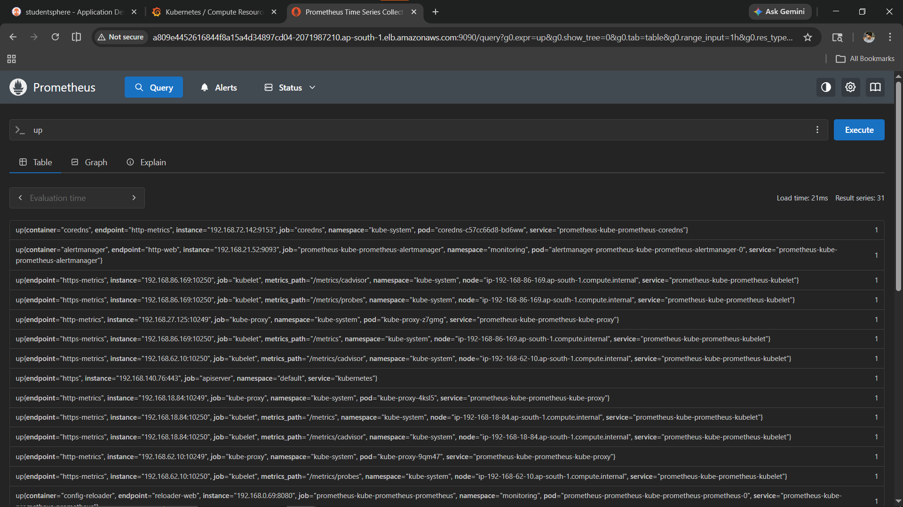

# 📊 Monitoring & Observability Stack

> Production-grade monitoring stack for StudentSphere on AWS EKS.
> Prometheus + Grafana + Alertmanager — deployed via Helm.
> Part of the [multi-cloud-devops-studentsphere](https://github.com/manesaurabh1704-devops/multi-cloud-devops-studentsphere) project.

---

## 📁 Repository Structure

```
monitoring-observability-stack/
├── prometheus/
│   └── values.yaml          # Prometheus Helm values
├── grafana/
│   └── datasource.yaml      # Grafana Prometheus datasource
├── alertmanager/
│   └── alertmanager.yaml    # Alert routing configuration
├── screenshots/             # Proof of deployment
└── README.md
```

---

## 🛠️ Stack Overview

| Tool | Purpose | Version |
|---|---|---|
| Prometheus | Metrics collection + storage | kube-prometheus-stack |
| Grafana | Dashboard visualization | Included in stack |
| Alertmanager | Alert routing + notifications | Included in stack |
| kube-state-metrics | Kubernetes resource metrics | Included in stack |
| node-exporter | Node hardware metrics | Included in stack |

---

## 🏗️ Architecture

```
Kubernetes Cluster (AWS EKS)
    │
    ├── node-exporter (per node) ──────────────┐
    ├── kube-state-metrics ────────────────────┤
    ├── studentsphere pods ────────────────────┤
    ├── argocd pods ───────────────────────────┤
    └── monitoring pods ──────────────────────►│
                                               │
                                         Prometheus
                                         (collect + store)
                                               │
                                    ┌──────────┴──────────┐
                                    │                     │
                                 Grafana            Alertmanager
                              (dashboards)           (alerts)
```

---

## ⚡ How to Deploy

### Prerequisites

```bash
# Helm 3.x required
helm version

# kubectl configured
kubectl get nodes

# AWS EKS cluster running
aws eks update-kubeconfig --region ap-south-1 --name studentsphere-cluster
```

### Step 1 — Add Helm Repository

```bash
helm repo add prometheus-community \
  https://prometheus-community.github.io/helm-charts
helm repo update
```

### Step 2 — Install Stack

```bash
helm install prometheus prometheus-community/kube-prometheus-stack \
  --namespace monitoring \
  --create-namespace \
  -f prometheus/values.yaml
```

Expected output:
```
NAME: prometheus
NAMESPACE: monitoring
STATUS: deployed
REVISION: 1
```

### Step 3 — Verify All Pods Running

```bash
kubectl get pods -n monitoring
```

Expected output:
```
NAME                                                     READY   STATUS
alertmanager-prometheus-kube-prometheus-alertmanager-0   2/2     Running
prometheus-grafana-xxxx                                  3/3     Running
prometheus-kube-prometheus-operator-xxxx                 1/1     Running
prometheus-kube-state-metrics-xxxx                       1/1     Running
prometheus-prometheus-kube-prometheus-prometheus-0       2/2     Running
prometheus-prometheus-node-exporter-xxxx                 1/1     Running (x4)
```

### Step 4 — Expose Services

```bash
# Grafana
kubectl patch svc prometheus-grafana -n monitoring \
  -p '{"spec": {"type": "LoadBalancer"}}'

# Prometheus
kubectl patch svc prometheus-kube-prometheus-prometheus -n monitoring \
  -p '{"spec": {"type": "LoadBalancer"}}'

# Alertmanager
kubectl patch svc prometheus-kube-prometheus-alertmanager -n monitoring \
  -p '{"spec": {"type": "LoadBalancer"}}'

# Get URLs
kubectl get svc -n monitoring | grep LoadBalancer
```

### Step 5 — Access UIs

```
Grafana:      http://<GRAFANA-URL>        admin / admin123
Prometheus:   http://<PROMETHEUS-URL>:9090
Alertmanager: http://<ALERTMANAGER-URL>:9093
```

---

## 📊 Key Metrics Observed

| Metric | Value | Description |
|---|---|---|
| CPU Utilisation | 3.23% | Total cluster CPU |
| Memory Utilisation | 54.2% | Total cluster memory |
| CPU Limits Commitment | 18.1% | CPU limits configured |
| studentsphere CPU | 0.565% | App namespace CPU |
| studentsphere Memory | 74.1% | App namespace memory |
| Prometheus Targets | 31 UP | All scrape targets active |

---

## 📸 Output / Proof

### Grafana Dashboard


### Kubernetes Cluster Overview


### StudentSphere Namespace Pods


### Prometheus Targets — All UP


### Prometheus Query — up


### Alertmanager


---

## 🐛 Troubleshooting

### Problem 1 — Pods Pending After Install
```
Error: 0/4 nodes available: Too many pods

Fix: Scale up node group
eksctl scale nodegroup \
  --cluster studentsphere-cluster \
  --name studentsphere-nodes \
  --nodes 4 \
  --nodes-max 5 \
  --region ap-south-1
```

### Problem 2 — Helm Install Already Exists
```
Error: cannot re-use a name that is still in use

Fix: Upgrade instead
helm upgrade prometheus prometheus-community/kube-prometheus-stack \
  --namespace monitoring \
  -f prometheus/values.yaml
```

### Problem 3 — Grafana No Data
```
Error: No data in dashboards

Fix: Wait 2-3 minutes for metrics to populate
Prometheus needs time to scrape initial metrics
```

### Problem 4 — Cannot Access Grafana UI
```
Error: Connection refused

Fix: Check LoadBalancer status
kubectl get svc prometheus-grafana -n monitoring
# Wait for EXTERNAL-IP to be assigned
```

---

## 🔗 Related Repositories

| Repository | Purpose |
|---|---|
| [multi-cloud-devops-studentsphere](https://github.com/manesaurabh1704-devops/multi-cloud-devops-studentsphere) | Main project |
| [kubernetes-production-setup](https://github.com/manesaurabh1704-devops/kubernetes-production-setup) | K8s manifests |
| [terraform-multi-cloud-infra](https://github.com/manesaurabh1704-devops/terraform-multi-cloud-infra) | Infrastructure as Code |
| [ci-cd-devops-pipelines](https://github.com/manesaurabh1704-devops/ci-cd-devops-pipelines) | Jenkins CI/CD |
| [devops-security-secrets](https://github.com/manesaurabh1704-devops/devops-security-secrets) | RBAC + Security |

---

## 👨‍💻 Author
**Saurabh Mane** — DevOps Engineer
- GitHub: [@manesaurabh1704-devops](https://github.com/manesaurabh1704-devops)

---

> ⭐ Star this repo if you find it helpful!